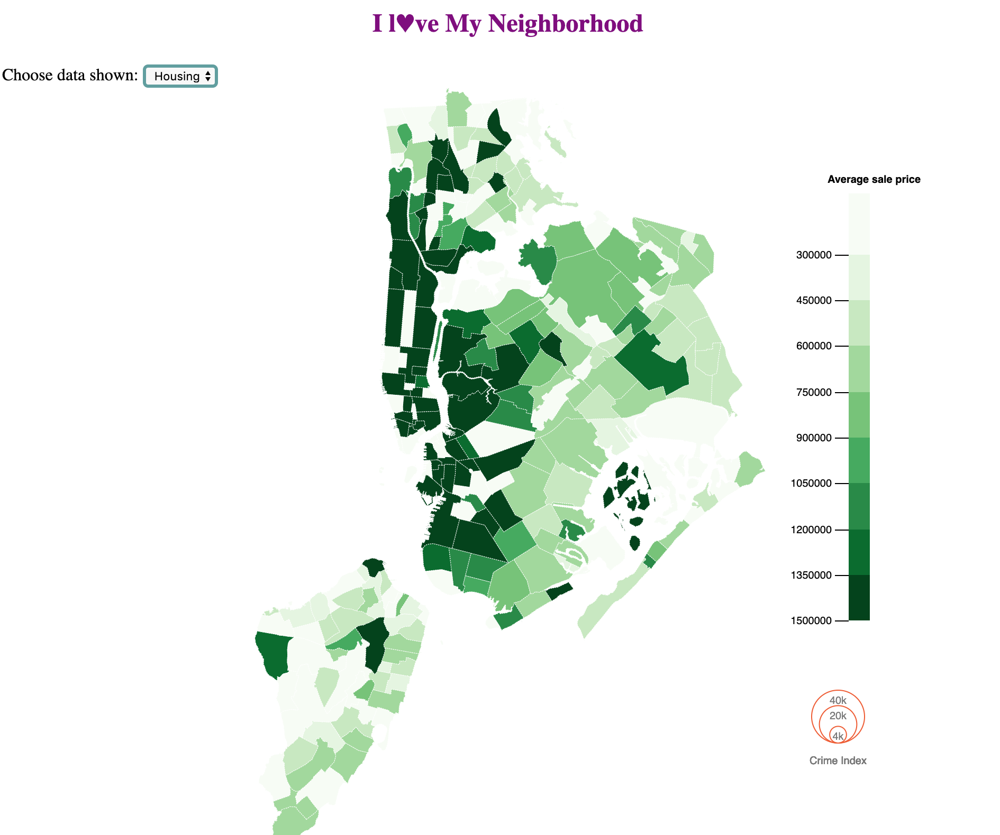
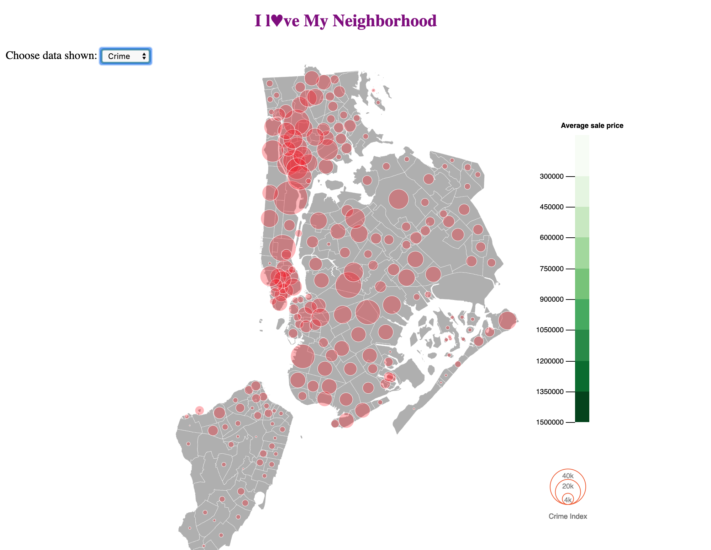
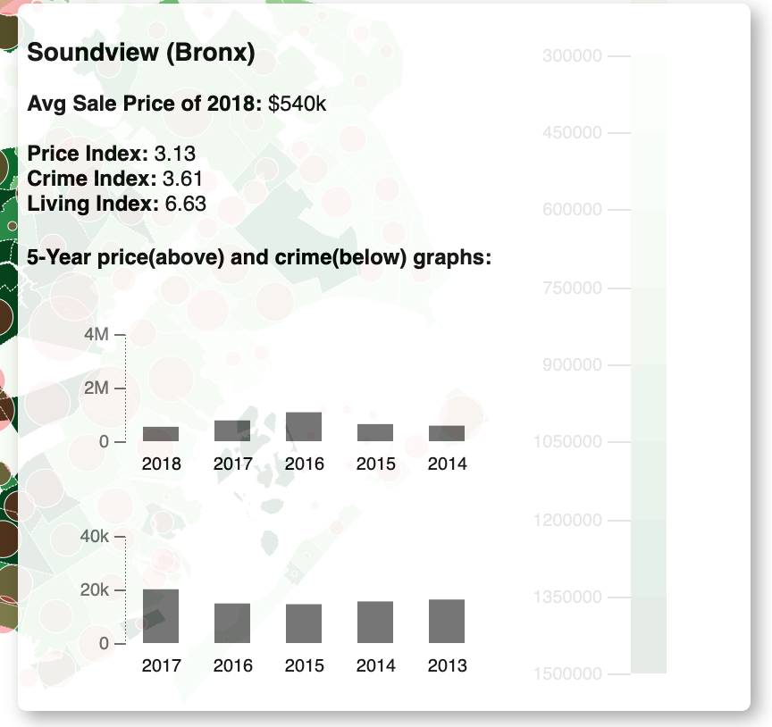

# I l♥ve My Neighborhood
### GATech CSE6242 Data and Visual Analytics Project Repo

This is the repo for CSE 6242 Data and Visual Analytics project. A place for project team member to share code and collaborate

### Screenshots
with both housing and crime data

with only housing data

with only crime data

Tooltips show details

Ready to try this out yourself?
[Yes](http://40.84.17.159/)

## Project team member
| Name | Email | Location | TimeZone |Available Time (EST)|
|----|----|---|---|---|
| Jun Peng | jpeng75@gatech.edu | New York City|EST| Weekday 9p.m. - 11:30 p.m. Weekend 9 a.m - 1 p.m |
| Boyan Lu | blu71@gatech.edu |Seattle|PST(EST-3hrs)|Weekday 10p.m. - 2 a.m. Sat 6 p.m. - 2 a.m. Sunday 1 p.m. - 2 a.m.|
| Shi Chen| shi.chen@gatech.edu |Toronto|EST|Weekday 9p.m. - 12 a.m. Sat 1 p.m. - 4 p.m.,9p.m. - 12 a.m. Sunday 8 a.m. - 12 p.m.,9p.m. - 12 a.m.|
| Siwei Wang| siwei.wang@gatech.edu |Toronto|EST|Weekday 9p.m. - 12 a.m. Sat 1 p.m. - 12 a.m. Sunday 10 a.m. - 11 p.m.|
| Neal Manaktola| nmanaktola3@gatech.edu |Toronto|EST|Weekday 7p.m. - 10 p.m. Sat 1 p.m. - 10 p.m. Sunday 1 p.m. - 10 p.m.|
| Yuying Wang| ywang3391@gatech.edu  |China|CST(EST+13hrs)|Weekday and weekends 9a.m. - 11a.m; 9p.m. - 12a.m|

## Developer's guide

### API

The API returns the housing data from postgres db. The database has been seeded with the data as specified in NY_neighborhood_avg_sales_2018.csv.

The API app is built in python and has dependencies as specified in the requirements.txt.
If you want to run this API locally:

1. Install virtualenv https://docs.python-guide.org/dev/virtualenvs/
2. Create virtual env `virtualenv .venv`
3. Install dependencies `pip install -r requirements.txt`
4. Please note you need to have postgresql installed as well.

Server IP: `54.89.25.157`
Endpoints: `/boroughs` to get the aggregate housing data i.e `http://54.89.25.157/boroughs`
Endpoints: `/crimes` to get the aggregate crime data i.e `http://54.89.25.157/crimes`

To run app locally `

#### Test API locally

1. Start local postgrest database `docker run --name postgres -e POSTGRES_PASSWORD=cse6242 -p 5432:5432 -d postgres`
1. Create a database in postgres CREATE DATABASE neighbourhood;
1. Start the API server `gunicorn -b 0.0.0.0:5000 app:api --reload`

#### Logging into API server

It's hosted on Amazon EC2 instance.
`ssh -i cse6242-project.pem ubuntu@ec2-54-89-25-157.compute-1.amazonaws.com`
The ssh-key is inside the repo. The project is in the home directory.

